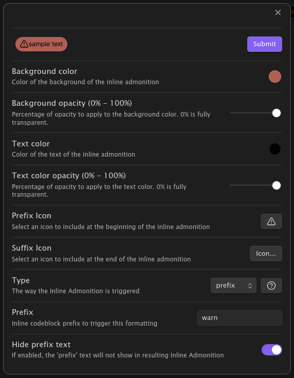

# Inline Admonitions for Obsidian

This plugin will allow you to format inline codeblocks to better stand out on the page.  For example, you may want to 
have all inline codeblocks that start with "IMPORTANT" to have a red background.  Where a codeblock may normally look 
like this:

This plugin can change it to look like this:

And its easy to use!

## Creating a new Inline Admonition

Open the "Inline Admonition" settings and click "Create New Inline Admonition" at the top to bring up a Modal to 
configure a new Inline Admonition.

- **Background Color** is the color of the Inline Admonition "bubble"
- **Color** is the text color
- **Type** defines how an Inline Admonition is triggered.  See the [types](#types) documentation for more details.

## Types

The Inline Admonition "Type" defines what triggers the codeblock to convert into an Inline Admonition.  Current supported
Types are:

- [Prefix Type](#prefix-type)
- [Suffix Type](#suffix-type)
- [Contains Type](#contains-type)

### Prefix Type

Prefix Inline Admonitions trigger when a codeblock starts with specific text.

**Settings**

- `prefix` defines the text at the start of the codeblock to trigger the Inline Admonition.

### Suffix Type

Suffix Inline Admonitions trigger when a codeblock ends with specific text.

**Settings**

- `suffix` defines the text at the end of the codeblock to trigger the Inline Admonition.

### Contains Type

Contains Inline Admonitions trigger when a codeblock contains specific text anywhere within it.

**Settings**

- `contains` defines the text within the codeblock to trigger the Inline Admonition.

## Notes

- This plugin is in alpha.  No promises on results...
- The CSS of the Inline Admonitions rides on Obsidian's Tag css.  I'll clean this up in a future release.
- Saving settings will trigger a re-render of the markdown views. Its possible to avoid this and is planned for a future release
- Similar to Contexual Typography this plugin will give you some css classes that you can manually manipulate

## Future work

- Regex to trigger Inline Admonitions
- Full CSS manipulation of codeblocks instead of inline style attributes

## Development

### Build

- `npm i` to install deps
- `npm run dev` to build and watch

### Release

Upload the files `manifest.json`, `main.js`, `styles.css` as binary attachments
